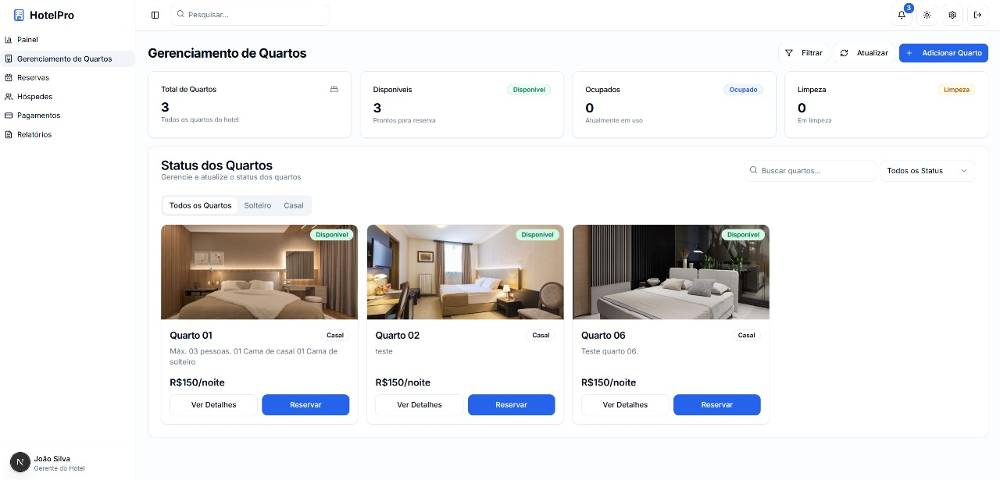

# Sistema de Gestão Hoteleira

Sistema completo para gerenciamento de hotel desenvolvido com Next.js 15, TypeScript, Tailwind CSS e Supabase.

## Funcionalidades Principais

- **Dashboard**: Painel com métricas, gráficos de ocupação e receita, visão geral do hotel
- **Gestão de Quartos**: Cadastro, visualização, atualização de status (Disponível, Ocupado, Limpeza) e remoção de quartos
- **Gestão de Reservas**: CRUD de reservas, check-in/check-out, atualização automática de status de quartos e hóspedes
- **Gestão de Hóspedes**: Cadastro, edição, visualização e gerenciamento de hóspedes, incluindo preferências
- **Gestão de Pagamentos**: Controle de pagamentos vinculados às reservas, com status e métodos
- **Preferências de Estadia**: Registro de preferências individuais dos hóspedes

## Demonstração

### Dashboard


### Gestão de Quartos



### Gestão de Reservas


### Gestão de Hóspedes


### Pagamentos


## Tecnologias Utilizadas

- [Next.js 15](https://nextjs.org/) - Framework React para aplicações web
- [TypeScript](https://www.typescriptlang.org/) - Tipagem estática
- [Tailwind CSS](https://tailwindcss.com/) - Framework utilitário de CSS
- [Supabase](https://supabase.com/) - Backend as a Service (banco de dados, autenticação, storage)
- [Radix UI](https://www.radix-ui.com/) - Componentes de UI acessíveis
- [Recharts](https://recharts.org/) - Gráficos e visualização de dados
- [React Hook Form](https://react-hook-form.com/) - Gerenciamento de formulários
- [Zod](https://zod.dev/) - Validação de dados
- [Zustand](https://zustand-demo.pmnd.rs/) - Gerenciamento de estado global
- [date-fns](https://date-fns.org/) - Manipulação de datas

## Entidades do Sistema

- **Quarto**: id, número, tipo (Solteiro/Casal), status, valor da diária, descrição, imagem
- **Hóspede**: id, nome, email, telefone, CPF, status, nascimento, gênero, endereço, nacionalidade, preferências
- **Reserva**: id, hóspede, quarto, datas de check-in/out, status (Reservado, Check-in Feito, Check-out Feito, Cancelada), status do pagamento, método, valor total
- **Pagamento**: id, reserva, valor, método, status (Processando, Aprovado, Rejeitado, Estornado), data
- **Preferência de Estadia**: id, hóspede, tipo e valor da preferência

## Regras de Negócio

- Check-in e check-out atualizam automaticamente status de quartos e hóspedes
- Status dos quartos: Disponível, Ocupado, Limpeza
- Status dos hóspedes: Sem estadia, Reservado, Hospedado
- CRUD completo para todas as entidades principais
- Integração total com Supabase para persistência e queries relacionais

## Estrutura do Projeto

```
app/               # Rotas do Next.js App Router
  ├── bookings/    # Gestão de reservas (CRUD, check-in/out)
  ├── dashboard/   # Painel principal (métricas, gráficos)
  ├── guests/      # Gestão de hóspedes
  ├── payments/    # Gestão de pagamentos
  └── rooms/       # Gestão de quartos
components/        # Componentes reutilizáveis
  ├── bookings/    # Componentes de reservas (dialogs, detalhes)
  ├── dashboard/   # Gráficos e widgets do painel
  ├── guests/      # Componentes de hóspedes (dialogs, detalhes)
  ├── rooms/       # Componentes de quartos (dialogs, detalhes)
  └── ui/          # Componentes de UI genéricos (inputs, tabelas, modais, etc)
hooks/             # Hooks personalizados (ex: useRooms, useRoomService, useSupabase)
lib/               # Serviços, tipos e utilitários
  ├── services/    # Serviços de acesso a dados (booking, room, etc)
  ├── types.ts     # Tipos e interfaces principais do sistema
  ├── supabase.ts  # Instância e configuração do Supabase
  └── utils.ts     # Funções utilitárias
public/            # Arquivos estáticos
styles/            # Estilos globais (Tailwind)
```

## Scripts Disponíveis

- `npm run dev` - Inicia o servidor de desenvolvimento
- `npm run build` - Gera a build de produção
- `npm run start` - Inicia o servidor de produção
- `npm run lint` - Executa o linter

## Requisitos

- Node.js 20.x ou superior
- npm ou yarn

## Instalação

```bash
# Clone o repositório
git clone https://github.com/Guilh-montalvao/hotel-management-system

# Entre na pasta do projeto
cd hotel-management-system

# Instale as dependências
npm install
# ou
yarn install

# Inicie o servidor de desenvolvimento
npm run dev
# ou
yarn dev
```

O aplicativo estará disponível em [http://localhost:3000](http://localhost:3000)

## Licença

Este projeto é licenciado sob a licença MIT - veja o arquivo LICENSE para mais detalhes.
